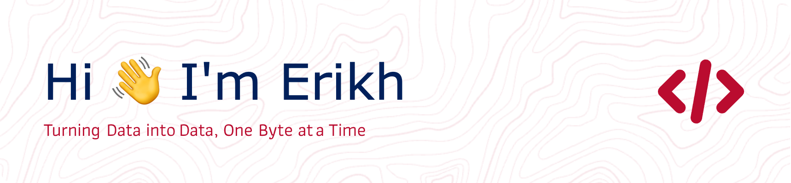

## ✨ About  ✨
I am a passionate and motivated individual with a deep interest in programming and data engineering. I specialize in innovative and swift problem-solving, with a keen eye for detail to ensure high quality in my work.

## ⌨️ Tech Stack 🖱️

  
  
  
  
  
  
  
  
  
  

## 📱 Social Media 📰

  
  

###